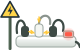

# Energy Hop v8 — Replace the Energy Vampire with a Sparking Power Strip: Implementation Plan

> **For agentic workers:** REQUIRED SUB-SKILL: Use superpowers:subagent-driven-development (recommended) or superpowers:executing-plans to implement this plan task-by-task. Steps use checkbox (`- [ ]`) syntax for tracking.

**Goal:** Replace the off-theme "energy vampire" creature with an island hazard from the energy-saving world: an **overloaded power strip that sparks**. It has a yellow ⚡ warning sign and powers the island's gadget. Switching the gadget off switches the strip off too.

**Architecture:** Same single-file game (`clean-hop-v8/index.html`) plus SVG sprites. The hazard keeps its current gameplay slot (near edge of an island, same hitbox, same spawn odds). Only its art, drawing code, text and link to the gadget change. Everything the game animates (switch light, sparks, cord current, caution stripe) is drawn in code on top of one static sprite. This is how the island gadgets already work.

**Tech Stack:** Vanilla ES5 JavaScript, Canvas 2D, SVG sprites, Web Audio synthesis, Service Worker cache. Tools already in the repo: `tools/check.py`, `tools/test-build.py`, `tools/run-scenario.py`, `tools/scenarios/*.js`.

**Spec:** This document. Sections 1–5 are the spec, section 7 is the task list.

**Baseline:** the current `clean-hop-v8` folder (21 Sep 2026, `sw.js` `VERSION = 'clean-hop-v8-12'`). Line numbers below refer to it.

---

## 1. Why the vampire has to go

Checked in the running game at 1024×768 and on a side-by-side sheet at 40/60/200 px:

| Problem | What you see |
|---|---|
| Wrong genre | A purple slime with googly eyes and fangs; a "monster" from a different game. Nothing else in the world is a creature except the heroes. |
| Wrong palette | Saturated violet `#7a5bd0` exists nowhere else. The world is pole-green metal, brass, cream plastic and warm electric glows. |
| The electrical parts don't read | The pale plug-prong "horns" vanish against the sky; the cord tail is a few pixels. |
| No link to the gadgets | It sits next to the island's gadget but has nothing to do with it. Switching the gadget off only fades it slightly. |
| Can appear alone | Hazard islands can spawn with **no gadget** (seen while testing), so there's nothing to switch off and no story. |
| Vampire wording | «ЭНЕРГОВАМПИР!», «Энерговампиры отступают», and a vampire tip. |

<p>

&nbsp;&nbsp;→&nbsp;&nbsp;

</p>

*Left: current sprite. Right: the reference design for this plan, drawn in the game's palette and checked in the game. Its red switch light and sparks are baked in here for the preview; in the game they're animated by code.*

---

## 2. Decisions to confirm before Task 1

| # | Decision | Options | Recommended |
|---|---|---|---|
| D1 | What the hazard is | **A.** Overloaded power strip with a ⚡ warning sign · **B.** Hot iron left on («ГОРЯЧО!») · **C.** Tangle of sparking wires | **A.** Most clearly "electricity", links naturally to the gadget it powers, and teaches a real safety habit. |
| D2 | Landing on a strip that's already switched off | **A.** Still a miss: one simple rule, "never land on the stripes" · **B.** Safe | **A** |
| D3 | Reward for switching it off | **A.** +2 points with «УДЛИНИТЕЛЬ ВЫКЛ! +2» · **B.** Visual only | **A**. Makes the risky island worth visiting. |
| D4 | First-meeting hint | **A.** A speech bubble the first time a strip appears (once per device) · **B.** None | **A** |

---

## 3. Behaviour spec

**Idea for the player:** *a power strip left on and overloaded is wasteful and dangerous. Don't touch it; switch off what it powers, and it goes quiet.*

| State | When | Looks | Sound |
|---|---|---|---|
| **Live** | Island's gadget is running | Red rocker switch glowing and gently pulsing; sparks flicker at the sockets every ~0.6 s; small yellow current dots run along its cord to the gadget; caution stripe on the grass at full strength | none (keeps the soundscape calm) |
| **Alarmed** | Hero is in the air above it (the existing "sailing over it" check) | Sparks crackle 3× faster | none |
| **Switched off** | 0.45 s after the island's gadget is switched off | Rocker turns grey, sparks and current stop, stripe dims to 55%. Popup «УДЛИНИТЕЛЬ ВЫКЛ! +2» | a low "power-down" hum |
| **Caught** | Hero lands within the hitbox | Burst of yellow-white sparks at the feet; popup «ИСКРЫ!» (or «ОЙ-ЁЙ!» if it was already off); normal fall | a short electric zap |

Rules that don't change: spawn chance and position (near edge, `-0.31·w`), hitbox (`strip + KW·0.22`), landing clamp, and that the check fires even on an already-visited island.

**New rule:** every strip island always gets a gadget, placed on the far half. The strip needs something to power.

---

## 4. Art spec

Palette, all taken from existing sprites: strip plastic `#ffffff → #cfd8d2` with edge `#9aa6a0` (the charger's socket box); plugs `#3d4a45` / `#f4f6f2`; post `#6b8270 / #4e6350 / #37473c` (the gadget poles); warning sign `#ffd44a` with `#20303a` outline; live red `#ff5b4a` (the factory beacon); sparks `#fff3a0` with `#ffc93c` edge (the sun-spark yellows).

### 4.1 Production sprite `clean-hop-v8/assets/sprites/power-strip.svg` (80×50, ground at y = 50)

```svg
<svg xmlns="http://www.w3.org/2000/svg" width="80" height="50" viewBox="0 0 80 50">
  <defs>
    <linearGradient id="strip" x1="0" y1="0" x2="0" y2="1">
      <stop offset="0" stop-color="#ffffff"/><stop offset="1" stop-color="#cfd8d2"/>
    </linearGradient>
    <linearGradient id="post" x1="0" y1="0" x2="1" y2="0">
      <stop offset="0" stop-color="#6b8270"/><stop offset="0.4" stop-color="#4e6350"/><stop offset="1" stop-color="#37473c"/>
    </linearGradient>
  </defs>
  <!-- warning sign on a short post: high voltage -->
  <rect x="8.5" y="15" width="3" height="35" rx="1.2" fill="url(#post)"/>
  <path d="M10 1.5 L19 17 L1 17 Z" fill="#ffd44a" stroke="#20303a" stroke-width="1.6" stroke-linejoin="round"/>
  <path d="M10.9 6 7.6 11.6h2.5l-.8 4 3.5-5.8h-2.5l.7-3.8Z" fill="#20303a"/>
  <!-- tangled cords looping back to the ground behind the strip -->
  <g fill="none" stroke-linecap="round" stroke-width="2.2">
    <path d="M25 26 C23 17 15 19 17 33" stroke="#3d4a45"/>
    <path d="M39 24 C39 13 52 13 50 24" stroke="#8a938d"/>
    <path d="M53 26 C55 16 66 19 63 31" stroke="#3d4a45"/>
  </g>
  <!-- the strip -->
  <rect x="16" y="36" width="60" height="11" rx="4" fill="url(#strip)" stroke="#9aa6a0" stroke-width="1"/>
  <rect x="18" y="37.2" width="56" height="2" rx="1" fill="#ffffff" opacity="0.8"/>
  <!-- three plugs crammed in -->
  <rect x="21" y="26" width="8" height="11" rx="3" fill="#3d4a45"/>
  <rect x="35" y="24" width="8" height="13" rx="3" fill="#f4f6f2" stroke="#9aa6a0" stroke-width="1"/>
  <rect x="49" y="26" width="8" height="11" rx="3" fill="#3d4a45"/>
  <!-- switch housing; the game draws the rocker (red while live) -->
  <rect x="63.5" y="31" width="10" height="6.5" rx="1.6" fill="#cfd8d2" stroke="#9aa6a0" stroke-width="1"/>
  <!-- mains cord stub; the game runs it on to the gadget -->
  <path d="M76 42 Q79 43 80 47" stroke="#3d4a45" stroke-width="2.4" fill="none" stroke-linecap="round"/>
</svg>
```

### 4.2 Anchors the code uses (fractions of the drawn width W / height H)

| Point | Sprite units | Fractions |
|---|---|---|
| Rocker switch rect | x 65, y 32.2, w 7, h 4 | x 0.8125, y 0.644, w 0.0875, h 0.08 |
| Spark point 1 (left socket gap) | (32, 33), aims up-left | (0.40, 0.66) |
| Spark point 2 (right socket gap) | (46, 33), aims up-right | (0.575, 0.66) |
| Spark point 3 (top of middle plug) | (39, 22), aims up | (0.4875, 0.44) |
| Mains cord port | (80, 47) | (1.0, 0.94) |

**Drawn size:** `W = strip · 2.6` (was `vamp · 2.4`); `H = W · 50 / 80`. The sprite is wider and flatter than the old one, and the slightly larger scale keeps the warning sign readable on small islands.

---

## 5. Copy (Russian)

| Where | Old | New |
|---|---|---|
| Fall popup (`fallIn`) | ЭНЕРГОВАМПИР! | ИСКРЫ! (live strip) · ОЙ-ЁЙ! (already off) |
| Switch-off popup (new) | — | УДЛИНИТЕЛЬ ВЫКЛ! +2 |
| Lose title after the strip (new) | — | Ой-ёй! Искры! |
| `MSG_MID` :1880 | Энерговампиры отступают. Так держать! | Искры погасли, удлинители выключены. Так держать! |
| `TIPS.any` :1906 | Энерговампиры — это приборы в режиме ожидания. Выключай их кнопкой. | Приборы в режиме ожидания тоже тратят энергию. Выключай их кнопкой. |
| First-meeting bubble (new) | — | line 1 «Осторожно, искры!» · line 2 «Не наступай на полоски — перепрыгни.» |

New tips, shown when the run ended on a strip:

```js
  strip:   ['Не включай много приборов в один удлинитель.',
            'Уходишь из дома — выключи удлинитель кнопкой.',
            'Искрит розетка? Не трогай её и позови взрослых!'],
```

## 6. Global Constraints

- Everything from the v8 concept plan still holds: single file, SVG sprites, works from `file://` (never read canvas pixels), ES5 style matching the file, «ты»-form and gender-neutral copy, no horizontal scroll at 320 px, `clean-hop-v7/` and older untouched.
- New sprite → `SPRITES` (index.html:1032) and `sw.js` `FILES`. Removed sprite `energy-vampire.svg` → out of both, file deleted. `python3 tools/check.py` must print `OK` after every task.
- Each task ends with its own `sw.js` `VERSION` bump (`clean-hop-v8-13` … `-16`).
- New `localStorage` key: `cleanHop.stripHint.v1` (set once the hint has been shown). Existing keys unchanged.
- No word «вампир» anywhere in the game or its tools when done.

## File map

| File | Change | Tasks |
|---|---|---|
| `clean-hop-v8/index.html` | rename, spawn rule, drawing, cord, switch-off, hint, tips | 1–4 |
| `clean-hop-v8/assets/sprites/power-strip.svg` | new | 2 |
| `clean-hop-v8/assets/sprites/energy-vampire.svg` | delete | 2 |
| `clean-hop-v8/sw.js` | files + VERSION | 1–4 |
| `tools/test-build.py` | hook getters `lastFall`, `stripHint` | 4 |
| `tools/scenarios/vampire.js` → `tools/scenarios/power-strip.js` | rename + extend | 1, 3 |
| `tools/scenarios/win.js`, `tips.js`, `world.js` | field names, tip text | 1 |

---

## 7. Tasks

### Task 1: Rename the hazard and pair it with a gadget (P1, S)

**Files:**
- Modify: `clean-hop-v8/index.html` — section title :1643; `makeStone` :1651–1652; spawn :1727–1741; `MSG_MID` :1880; `TIPS.any` :1906; `fallIn` :2036; `land` :2058–2064 and :2105–2106; draw block :3525–3538; `SPRITES` :1032 stays until Task 2
- Rename: `tools/scenarios/vampire.js` → `tools/scenarios/power-strip.js`
- Modify: `tools/scenarios/win.js:8`, `tools/scenarios/tips.js:9` and `:43`, `tools/scenarios/world.js:8`
- Modify: `clean-hop-v8/sw.js` — `VERSION = 'clean-hop-v8-13'`

**Interfaces:**
- Produces: stone fields `strip` (half-width, 0 = none), `stripX` (centre offset); fall reason `'sparks'`. Tasks 2–4 use these names.

- [ ] **Step 1: Failing check.** Add a pairing test at the top of `tools/scenarios/power-strip.js` (after renaming the file). It must fail on the baseline:

```js
// every hazard island must carry a gadget for the strip to power
let lonely = 0, seen = 0;
for (let run = 0; run < 3; run++) {
  for (let i = 0; i < 30 && t.mode === 'play'; i++) {
    t.stones.forEach(s => { if (s.strip && !s.__seen) { s.__seen = 1; seen++; if (!s.gadget) lonely++; } });
    if (!(await step())) break;
  }
  if (t.mode === 'over') { document.getElementById('againBtn').click(); await sleep(300); }
}
```
and add `seen > 0 && lonely === 0` to the scenario's `pass`. Run `python3 tools/run-scenario.py tools/scenarios/power-strip.js` → `pass: false`. The baseline has no `strip` field, and after the rename it would have lonely hazards.

- [ ] **Step 2: Rename** in `index.html`: `vamp` → `strip`, `vampX` → `stripX`, `'vampire'` → `'sparks'`. Find the places with `grep -n "vamp\|vampire" clean-hop-v8/index.html`; sprite name and drawing change in Task 2. Update comments to talk about a power strip. The section title becomes `6. Stones, power strips and collectibles`.

- [ ] **Step 3: Spawn rule** (:1727–1741):

```js
  // Overloaded power strip: sits on the near edge, so the safe zone is the far half.
  // Only on stones roomy enough to still leave a fair landing strip.
  if (!calm && stonesCleared >= 6 && type !== 'crumble' && gap < MAX_D * 0.70 &&
      w > VW * 0.10 && Math.random() < 0.14 + 0.26 * diff) {
    s.strip = w * 0.17;
    s.stripX = -w * 0.31;
  }

  // Something left running in broad daylight: landing here switches it off.
  // Kept off crumblers (they sink away); a power strip always powers one.
  if (type !== 'crumble' && (s.strip || Math.random() < GADGET_CHANCE)) {
    var side = s.strip ? 1 : (Math.random() < 0.5 ? -1 : 1);
    s.gadget = { kind: pick(GADGET_KINDS), dx: side * rand(0.24, 0.30), on: true,
                 glow: 1, wait: 0, ph: rand(0, TAU), speed: 1, spin: 0 };
  }
```

- [ ] **Step 4: Copy.** `MSG_MID` :1880 → `'Искры погасли, удлинители выключены. Так держать!'`; `TIPS.any` :1906 → `'Приборы в режиме ожидания тоже тратят энергию. Выключай их кнопкой.'`; `fallIn` popup → `reason === 'sparks' ? 'ИСКРЫ!' : 'ОЙ-ЁЙ!'`.

- [ ] **Step 5: Tools.** Rename `.vamp`/`.vampX` in the four scenario files. In `tips.js:43` swap the old stand-by tip for the new `TIPS.any` text. In `power-strip.js` the popup check becomes `p.t === 'ИСКРЫ!'`.

- [ ] **Step 6: Verify.** `grep -rn -i "vamp\|вампир" clean-hop-v8/index.html tools/` → only the sprite name `'energy-vampire'` (Task 2 removes it). `python3 tools/check.py` → `OK`. `run-scenario.py` on `power-strip.js`, `tips.js`, `win.js` → all `pass: true`.

- [ ] **Step 7: Bump the offline cache** — `sw.js` → `var VERSION = 'clean-hop-v8-13';`

---

### Task 2: The power-strip sprite, caution stripe and sparks (P1, M)

**Files:**
- Create: `clean-hop-v8/assets/sprites/power-strip.svg` (Section 4.1, verbatim)
- Delete: `clean-hop-v8/assets/sprites/energy-vampire.svg`
- Modify: `clean-hop-v8/index.html` — `SPRITES` :1032 (`'energy-vampire': {}` → `'power-strip': {}`); `makeStone` (new fields); update loop :2327 area; draw block :3525–3538 → `drawPowerStrip(s, px, top)`
- Modify: `clean-hop-v8/sw.js` — swap the file in `FILES`, `VERSION = 'clean-hop-v8-14'`

**Interfaces:**
- Consumes: `strip`, `stripX` (Task 1).
- Produces: stone fields `stripLive` (eased 1 live → 0 off), `stripCut` (bool, set in Task 3), `stripWait` (seconds, counted down in Task 3); functions `drawPowerStrip(s, px, top)`, `drawCaution(x0, x1, y, a)`, `zigzag(x, y, len, ang)`. Task 3 reads `stripLive`, `stripCut` and `stripWait`.

- [ ] **Step 1: Sprite and registration.** Create the SVG, update `SPRITES` and `sw.js` `FILES`, delete the old file. `python3 tools/check.py` → `OK`.

- [ ] **Step 2: State fields** in `makeStone` next to `strip`/`stripX`:

```js
    stripLive: 1,                               // 1 live .. 0 switched off (eased)
    stripCut: false,                            // its gadget has been switched off
    stripWait: 0,                               // beat between the gadget click and the strip's
```
Ease it in `update()`, inside the stones loop right after the `if (s.gadget) { ... }` block (:2327–2337):

```js
    if (s.strip) {
      s.stripLive += ((s.stripCut ? 0 : 1) - s.stripLive) * Math.min(1, dt * 5);
    }
```

- [ ] **Step 3: Drawing.** Replace the whole vampire block at :3525–3538 with `if (s.strip) drawPowerStrip(s, px, top);` and add these functions above `drawStone`:

```js
/** A yellow-and-black caution band on the grass: exactly where not to land. */
function drawCaution(x0, x1, y, a) {
  var h = 4, step = 7;
  ctx.save();
  ctx.globalAlpha = a;
  ctx.beginPath();
  ctx.rect(x0, y - h / 2, x1 - x0, h);
  ctx.clip();
  ctx.fillStyle = '#ffd44a';
  ctx.fillRect(x0, y - h / 2, x1 - x0, h);
  ctx.fillStyle = '#20303a';
  for (var sx = x0 - h; sx < x1; sx += step) {
    ctx.beginPath();
    ctx.moveTo(sx, y + h / 2);
    ctx.lineTo(sx + h, y - h / 2);
    ctx.lineTo(sx + h + step / 2, y - h / 2);
    ctx.lineTo(sx + step / 2, y + h / 2);
    ctx.closePath();
    ctx.fill();
  }
  ctx.restore();
}

/** One jagged little spark, `len` long, heading along angle `ang`. */
function zigzag(x, y, len, ang) {
  var c = Math.cos(ang), s = Math.sin(ang);
  ctx.beginPath();
  ctx.moveTo(x, y);
  for (var i = 1; i <= 3; i++) {
    var d = len * i / 3, o = (i % 2 ? 1 : -1) * len * 0.25;
    ctx.lineTo(x + c * d - s * o, y + s * d + c * o);
  }
  ctx.stroke();
}

/**
 * An overloaded power strip on the island's near edge - the part you must
 * not land on. Live while its gadget runs: red switch, sparks at the
 * sockets. It goes quiet once that gadget is switched off.
 */
function drawPowerStrip(s, px, top) {
  var cx = px + s.stripX, sr = s.strip;
  var W = sr * 2.6, H = W * 50 / 80;                 // sprite is 80x50
  var live = s.stripLive;
  var L = cx - W / 2, Tp = top + 3 - H;              // sprite's top-left corner
  var near = phase === 'air' && hop.y < top &&       // someone is sailing over it
             Math.abs(hop.x - (s.x + s.stripX)) < sr * 4;

  drawCaution(cx - sr, cx + sr, top + 4, 0.55 + 0.45 * live);  // on the grass lip, in front
  sprB('power-strip', cx, top + 3, W);

  /* the rocker switch: lit red while live, grey once off */
  var rx = L + 0.8125 * W, ry = Tp + 0.644 * H, rw = 0.0875 * W, rh = 0.08 * H;
  if (live > 0.02) {
    var pulse = 0.8 + 0.2 * Math.sin(T * 3 + s.id);
    var gl = ctx.createRadialGradient(rx + rw / 2, ry + rh / 2, rw * 0.2,
                                      rx + rw / 2, ry + rh / 2, rw * 1.6);
    gl.addColorStop(0, 'rgba(255,91,74,' + 0.6 * live * pulse + ')');
    gl.addColorStop(1, 'rgba(255,91,74,0)');
    ctx.fillStyle = gl;
    ellF(ctx, rx + rw / 2, ry + rh / 2, rw * 1.6, rw * 1.6);
  }
  ctx.fillStyle = mix('#8a938d', '#ff5b4a', live);
  fillRR(ctx, rx, ry, rw, rh, Math.max(1, rw * 0.15));

  /* sparks at the crammed sockets: now and then, and fast when threatened */
  if (live > 0.5 && Math.sin(T * (near ? 15 : 5) + s.id * 1.7) > 0.55) {
    var len = Math.max(4, W * 0.09);
    ctx.lineCap = 'round';
    ctx.lineJoin = 'round';
    ctx.strokeStyle = '#ffc93c';
    ctx.lineWidth = Math.max(1.8, W * 0.028);
    zigzag(L + 0.40 * W, Tp + 0.66 * H, len, -2.4);
    zigzag(L + 0.575 * W, Tp + 0.66 * H, len, -0.7);
    zigzag(L + 0.4875 * W, Tp + 0.44 * H, len, -1.57);
    ctx.strokeStyle = '#fff3a0';
    ctx.lineWidth = Math.max(1, W * 0.014);
    zigzag(L + 0.40 * W, Tp + 0.66 * H, len, -2.4);
    zigzag(L + 0.575 * W, Tp + 0.66 * H, len, -0.7);
    zigzag(L + 0.4875 * W, Tp + 0.44 * H, len, -1.57);
  }
}
```
The old block's bob/rotation and shadow ellipse go away. A strip doesn't wobble; the caution band replaces the shadow.

- [ ] **Step 4: Verify.** In the test build, put a strip on the next island if none turns up (`n.strip = n.w * 0.17; n.stripX = -n.w * 0.31;`). Screenshot at 360×640, 466×750 and 1024×768 on both a murky (start) and a clean (near finish) world. Check:
  - The ⚡ sign is visible.
  - The caution band is clearly visible in front of the strip, not hidden under it. It spans `±strip` around the strip's centre; the hero misses whenever any part of its body (`KW·0.22` either side of its centre) is over the band.
  - The switch glows red.
  - The sparks flicker.
  - It doesn't cover the gadget on the far half, even on the narrowest strip island (`w ≈ VW·0.10`).

  Then run `python3 tools/check.py` → `OK`.

- [ ] **Step 5: Bump the offline cache** — `sw.js` → `var VERSION = 'clean-hop-v8-14';`

---

### Task 3: The strip powers the gadget — cord, switch-off, zap (P1, M)

**Files:**
- Modify: `clean-hop-v8/index.html` — sounds after `sndSwitch` (:586); `switchOff` :2040–2056; update loop (Task 2's `if (s.strip)` block); `land` hazard branch :2058–2064; `drawStone` (cord before the gadget, :3479); new `drawStripCord`, `stripSwitchOff`
- Modify: `tools/scenarios/power-strip.js`
- Modify: `clean-hop-v8/sw.js` — `VERSION = 'clean-hop-v8-15'`

**Interfaces:**
- Consumes: `stripLive`, `stripCut`, `stripWait` (Task 2), `s.gadget` (always present on strip islands, Task 1), `gadgetH(kind)`.
- Produces: `stripSwitchOff(s)`, `drawStripCord(s, px, top)`, `sndStripOff()`, `sndZap()`.

- [ ] **Step 1: Extend the scenario** `tools/scenarios/power-strip.js`. After landing on the gadget side of a strip island, wait 1200 ms, then check:
  - `vs.gadget.on === false`
  - `vs.stripCut === true`
  - `vs.stripLive < 0.1`
  - `t.pops.some(p => p.t === 'УДЛИНИТЕЛЬ ВЫКЛ! +2')`
  - the score rose by at least 4 (landing +1, gadget +1, strip +2)

  After landing on the strip itself, the popup is «ОЙ-ЁЙ!»: it was already switched off, per D2. Run it → `pass: false`.

- [ ] **Step 2: Sounds** (after `sndSwitch`):

```js
/* A power strip goes quiet: a clack, then its hum winding down. Caught: a zap. */
function sndStripOff() { noiseBurst(0.04, 0.14, 5000, 1800); tone('sine', 300, 70, 0.5, 0.06, 0.05); }
function sndZap()      { noiseBurst(0.16, 0.16, 8000, 2500); tone('square', 110, 55, 0.28, 0.05); }
```

- [ ] **Step 3: Switch-off coupling.** At the end of `switchOff(s)` (before its closing brace):

```js
  if (s.strip && !s.stripCut) s.stripWait = 0.45;  // a beat later its strip goes too
```
In the `if (s.strip)` update block, before the easing line:

```js
      if (s.stripWait > 0 && mode === 'play') {
        s.stripWait -= dt;
        if (s.stripWait <= 0) stripSwitchOff(s);
      }
```
And the new function next to `switchOff`:

```js
/** The gadget is off, so its power strip clicks off too - worth two more. */
function stripSwitchOff(s) {
  var top = stoneTop(s), sx = s.x + s.stripX;
  s.stripCut = true;
  score += 2;
  popup(sx, top - KW * 3.7, 'УДЛИНИТЕЛЬ ВЫКЛ! +2', '#ffe27a');
  flyScore(sx - camX, top - KW, '+2', '#ffe27a');
  sparkle(sx + s.strip * 0.9, top - 4, '#ffe27a');
  sndStripOff();
  updateHud();
}
```

- [ ] **Step 4: Caught.** In `land`'s hazard branch, before `fallIn(...)`:

```js
      sparkle(hop.x, top - 4, '#fff3a0');             // it bites back
      sparkle(hop.x, top - 4, '#ffc93c');
      if (!s.stripCut) sndZap();
      fallIn(s.stripCut ? 'strip' : 'sparks');
```
(`fallIn` already shows «ИСКРЫ!» only for `'sparks'`.)

- [ ] **Step 5: The cord to the gadget, with current running while live.** Draw it before the gadget so both ends tuck under their owners. In `drawStone`, the line at :3479 becomes:

```js
  if (s.strip) drawStripCord(s, px, top);
  if (s.gadget) drawGadget(s, px, top);
```

```js
/** The strip's mains cord across the grass to the gadget it keeps running. */
function drawStripCord(s, px, top) {
  var G = s.gadget;
  if (!G) return;
  var W = s.strip * 2.6, H = W * 50 / 80;
  var x0 = px + s.stripX + W / 2, y0 = top + 3 - H * 0.06;          // sprite's cord port
  var x1 = px + G.dx * s.w - gadgetH(G.kind) * 0.22, y1 = top + 1;  // the gadget's foot
  var mx = (x0 + x1) / 2, my = top + 4;                              // lies on the grass
  ctx.strokeStyle = '#3d4a45';
  ctx.lineWidth = Math.max(2, W * 0.03);
  ctx.lineCap = 'round';
  ctx.beginPath();
  ctx.moveTo(x0, y0);
  ctx.quadraticCurveTo(mx, my, x1, y1);
  ctx.stroke();
  if (s.stripLive < 0.1) return;
  for (var k = 0; k < 3; k++) {                                      // current flowing out
    var u = (T * 0.9 + s.id * 0.37 + k / 3) % 1, a = 1 - u;
    var bx = a * a * x0 + 2 * a * u * mx + u * u * x1;
    var by = a * a * y0 + 2 * a * u * my + u * u * y1;
    ctx.globalAlpha = s.stripLive;
    ctx.fillStyle = 'rgba(255,214,90,0.35)';
    ellF(ctx, bx, by, W * 0.05, W * 0.05);
    ctx.fillStyle = '#ffd65a';
    ellF(ctx, bx, by, W * 0.022, W * 0.022);
  }
  ctx.globalAlpha = 1;
}
```

- [ ] **Step 6: Verify.** Scenario → `pass: true`. On a moving island, the cord and both ends move with the island. Watch one full sequence: land → gadget clicks off (0.2 s) → strip clicks off (0.45 s later) → current stops, switch greys, stripe dims. `python3 tools/check.py` → `OK`.

- [ ] **Step 7: Bump the offline cache** — `sw.js` → `var VERSION = 'clean-hop-v8-15';`

---

### Task 4: Teach it — first-meeting hint, tips, title (P1, S)

**Files:**
- Modify: `clean-hop-v8/index.html` — `LS_*` keys :503–504; state vars near :1491; `reset()` :1936; `update()` after the stones loop; `render()` after `drawEffects();` (:3928); `TIPS` :1898; `pickTip` :1910; `gameOver` title :2005; `fallIn` :2025
- Modify: `tools/test-build.py` (hook getters), `tools/scenarios/power-strip.js`
- Modify: `clean-hop-v8/sw.js` — `VERSION = 'clean-hop-v8-16'`

**Interfaces:**
- Consumes: `strip`, `stripX` (Task 1), `lastFall` reason `'sparks'` (Task 3).
- Produces: globals `lastFall` (string or null), `stripHint` (`{ s, t }` or null), `LS_HINT`; function `drawStripHint()`.

- [ ] **Step 1: Hook getters** in `tools/test-build.py` `HOOK`, next to `energy`:

```js
  get lastFall() { return __get(function () { return lastFall; }); },
  get stripHint() { return __get(function () { return stripHint; }); },
```
Extend `power-strip.js`:
  - The first strip that comes on screen sets `t.stripHint`. The headless run starts with empty storage, so it shows.
  - After the fall onto a live strip, check that `t.lastFall === 'sparks'`, the title reads «Ой-ёй! Искры!», and `#tipMsg` is one of the three `TIPS.strip` lines.

  Run it → `pass: false`.

- [ ] **Step 2: State.**

```js
var LS_HINT = 'cleanHop.stripHint.v1';
```
next to the other keys, and near the other run state:

```js
var lastFall = null;             // what ended the run: 'sparks', 'strip', 'sludge'...
var stripHint = null;            // first power strip ever seen: { s: stone, t: seconds left }
var stripHintSeen = false;
try { stripHintSeen = localStorage.getItem(LS_HINT) === '1'; } catch (e) {}
```
`reset()`: add `lastFall = null; stripHint = null;`. `fallIn(reason)`: add `lastFall = reason;` as its first statement after the guard.

- [ ] **Step 3: The hint** — in `update()` after the stones loop:

```js
  if (!stripHintSeen && mode === 'play') {          // first meeting: say what it is
    for (var sh = 0; sh < stones.length; sh++) {
      var ss = stones[sh];
      if (ss.strip && !ss.visited && ss.x - camX < VW * 0.85) {
        stripHint = { s: ss, t: 5 };
        stripHintSeen = true;
        save(LS_HINT, '1');
        break;
      }
    }
  }
  if (stripHint) { stripHint.t -= dt; if (stripHint.t <= 0) stripHint = null; }
```
In `render()`, right after `drawEffects();`, add `drawStripHint();`:

```js
/** First power strip ever: a speech bubble pointing at it for five seconds. */
function drawStripHint() {
  if (!stripHint) return;
  var s = stripHint.s, top = stoneTop(s);
  var x = s.x + s.stripX - camX, y = top - s.strip * 1.9 - KW * 0.4;
  var a = clamp(Math.min(stripHint.t, 5 - stripHint.t) * 3, 0, 1);  // fades in and out
  var fs = Math.max(12, Math.round(KW * 0.3));
  var l1 = 'Осторожно, искры!', l2 = 'Не наступай на полоски — перепрыгни.';
  ctx.font = '800 ' + fs + 'px "Avenir Next Rounded","Trebuchet MS","Segoe UI",system-ui,sans-serif';
  var bw = Math.max(ctx.measureText(l1).width, ctx.measureText(l2).width) + fs * 1.4;
  var bh = fs * 3.1;
  var bx = clamp(x - bw / 2, 8, VW - bw - 8), by = y - bh;
  ctx.globalAlpha = a;
  ctx.fillStyle = '#fffaf0';
  fillRR(ctx, bx, by, bw, bh, fs * 0.8);
  ctx.beginPath();                                   // the tail, pointing down at it
  ctx.moveTo(x - fs * 0.5, by + bh - 1);
  ctx.lineTo(x, by + bh + fs * 0.7);
  ctx.lineTo(x + fs * 0.5, by + bh - 1);
  ctx.fill();
  ctx.textAlign = 'center';
  ctx.fillStyle = '#20303a';
  ctx.fillText(l1, bx + bw / 2, by + fs * 1.35);
  ctx.fillStyle = '#5d7a83';
  ctx.fillText(l2, bx + bw / 2, by + fs * 2.55);
  ctx.textAlign = 'left';
  ctx.globalAlpha = 1;
}
```

- [ ] **Step 4: Tips and title.** Add the `strip` list from Section 5 to `TIPS`. `pickTip()` starts with:

```js
  if (lastFall === 'sparks' || lastFall === 'strip') return pick(TIPS.strip);
```
`gameOver` title:

```js
  elOverTitle.textContent = won ? 'Энергия сбережена!'
    : lastFall === 'sparks' ? 'Ой-ёй! Искры!'
    : (leaves > 0 ? 'Ой-ёй! Зато искорок много.' : 'Ой-ёй!');
```

- [ ] **Step 5: Verify.** Scenario → `pass: true`. `tips.js` still passes (a normal fall keeps the old tip logic). Manually: the bubble never goes off-screen at 320 px width, and the pause card's tip still comes from `TIPS.any`. `python3 tools/check.py` → `OK`.

- [ ] **Step 6: Bump the offline cache** — `sw.js` → `var VERSION = 'clean-hop-v8-16';`

---

### Task 5: QA (P1, S)

- [ ] Run every scenario: `for f in tools/scenarios/*.js; do python3 tools/run-scenario.py "$f"; done` → each prints `pass: true`.
- [ ] `grep -rn -i "vamp\|вампир" clean-hop-v8 tools` prints nothing. `python3 tools/check.py` → `OK`.
- [ ] Fill in:

| Check | 360×640 | 466×750 | 1280×800 |
|---|---|---|---|
| Strip readable at game size; ⚡ sign and red switch visible | | | |
| Caution band matches the no-landing zone | | | |
| Gadget always on the far half, never covered | | | |
| Land safe side → gadget off → «УДЛИНИТЕЛЬ ВЫКЛ! +2» → strip quiet | | | |
| Land on live strip → sparks, zap, «ИСКРЫ!», title «Ой-ёй! Искры!», strip tip | | | |
| First strip ever → hint bubble for 5 s, never again after reload | | | |
| Moving island: cord and current follow | | | |
| Offline reload after the update picks up `clean-hop-v8-16` | | | |

---

## 8. Out of scope

- Hitbox size, spawn odds or placement changes.
- More hazard kinds (the iron and the wire tangle from D1 stay ideas).
- Any change to the island gadgets' look or behaviour.
